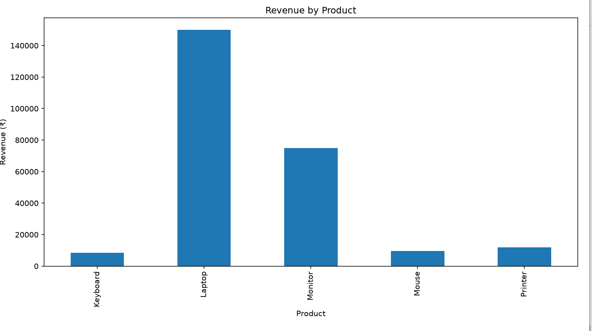

# Retail Sales Data Analyzer 📊

## Project Overview

Retail Sales Data Analyzer is a Python-based data analytics project that analyzes retail sales data and provides useful business insights.

The project calculates revenue, identifies best-selling products, finds highest revenue products, and visualizes sales data using charts.

## Technologies Used

- Python
- Pandas
- Matplotlib
- CSV

## Features

✅ Read sales data from CSV file  
✅ Calculate total revenue  
✅ Create revenue column  
✅ Find best-selling product  
✅ Find highest revenue product  
✅ Calculate average revenue per sale  
✅ Display top 3 products by revenue  
✅ Generate bar chart visualization  
✅ Export analysis report as CSV

## Project Structure
Retail-Sales-Data-Analyzer

│── analyzer.py
│── sales_data.csv
│── sales_analysis_report.csv
│── requirements.txt
│── README.md
│── report.txt
## Project Output

