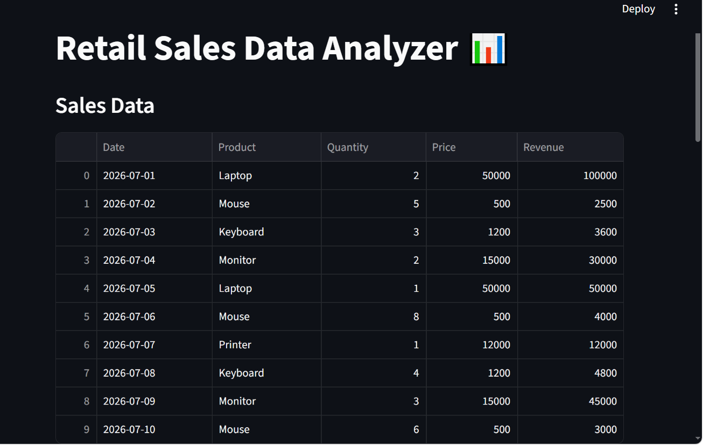

# Retail Sales Data Analyzer 📊

## Project Overview

Retail Sales Data Analyzer is a Python-based data analytics project that analyzes retail sales data and provides useful business insights.

The project calculates revenue, identifies best-selling products, finds highest revenue products, and visualizes sales data using charts.

## Technologies Used

- Python
- Pandas
- Matplotlib
- Streamlit
- CSV

## Features

✅ Read sales data from CSV file  
✅ Calculate total revenue  
✅ Create revenue column  
✅ Find best-selling product  
✅ Find highest revenue product  
✅ Calculate average revenue per sale  
✅ Display top 3 products by revenue  
✅ Generate bar chart visualization  
✅ Export analysis report as CSV  
✅ Interactive Streamlit dashboard  

## Project Structure

```
Retail-Sales-Data-Analyzer

│── analyzer.py
│── app.py
│── sales_data.csv
│── sales_analysis_report.csv
│── requirements.txt
│── README.md
│── report.txt
│── screenshots
    │── sales_analysis_output.png
    │── dashboard.png
        dashboard1.png
```

## Project Output


## Streamlit Dashboard

This project also includes an interactive dashboard built using Streamlit.

Features:

- View sales data
- Calculate total revenue
- Find average revenue per sale
- Identify best-selling products
- Identify highest revenue products
- Visualize revenue using charts


## How to Run the Project

### Install Required Libraries

```bash
pip install -r requirements.txt
```

### Run Python Analysis

```bash
python analyzer.py
```

### Run Streamlit Dashboard

```bash
streamlit run app.py
```


## Dashboard Preview




## Future Improvements

- Add SQL database integration
- Add interactive filters
- Add Power BI dashboard
- Deploy Streamlit application online
- Add real-time sales analysis